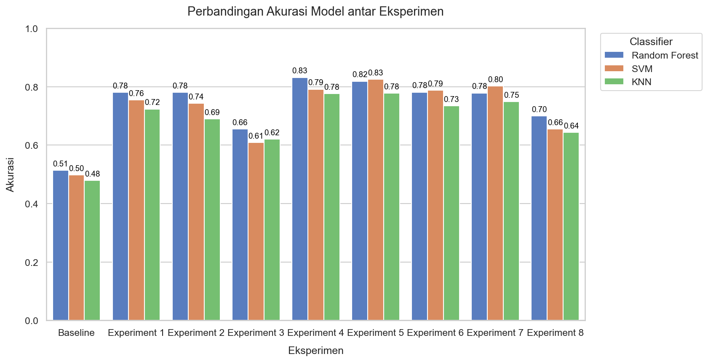

# Cloud Image Classification System

Sistem klasifikasi citra awan berbasis pemrosesan citra digital tradisional (preprocessing manual, ekstraksi fitur warna dan tekstur, serta klasifikasi menggunakan Random Forest, SVM, dan KNN).

## Tools dan Dependensi

### Persyaratan Sistem
- Python 3.10 atau versi lebih baru
- Dataset Ground-based Cloud Dataset (GCD)

### Dependensi Python
Instalasi pustaka yang diperlukan:
```cmd
python -m pip install numpy pandas opencv-python scikit-image scikit-learn scipy matplotlib seaborn tqdm jupyter python-dotenv
```

Untuk akselerasi GPU (opsional, memerlukan NVIDIA GPU dan CUDA Toolkit):
```cmd
python -m pip install cupy-cuda12x
```

## Langkah-Langkah (Steps)

### 1. Konfigurasi Dataset
Buat berkas `.env` pada direktori root proyek dengan menyalin berkas `.env.example`:
```cmd
copy .env.example .env
```
Buka berkas `.env` dan atur path direktori dataset Anda:
```env
DATASET_ROOT=D:/path/ke/GCD
```

### 2. Struktur Direktori Proyek
Pastikan struktur direktori utama adalah sebagai berikut:
```
.
├── dataset/
├── notebooks/
│   ├── 00_baseline.ipynb
│   ├── 01_experiment1.ipynb
│   ├── 02_experiment2.ipynb
│   ├── 03_experiment3.ipynb
│   ├── 04_experiment4.ipynb
│   ├── 05_experiment5.ipynb
│   ├── 06_experiment6.ipynb
│   ├── 07_experiment7.ipynb
│   └── 08_experiment8.ipynb
├── results/
│   ├── figures/
│   └── metrics.csv
├── src/
│   ├── image_processing.py
│   ├── loader.py
│   └── generate_metrics_table.py
├── .env
└── README.md
```

### 3. Menjalankan Notebook Eksperimen
Jalankan berkas notebook di dalam folder `notebooks/` secara berurutan. Setiap notebook merepresentasikan eksperimen dengan konfigurasi preprocessing dan ekstraksi fitur yang berbeda:

- **Baseline (`00_baseline.ipynb`)**: Tanpa preprocessing tambahan.
- **Experiment 1 (`01_experiment1.ipynb`)**: Histogram Equalization + Gaussian Filter.
- **Experiment 2 (`02_experiment2.ipynb`)**: CLAHE + Morphological Opening.
- **Experiment 3 (`03_experiment3.ipynb`)**: Haar Wavelet Denoise + Unsharp Mask.
- **Experiment 4 (`04_experiment4.ipynb`)**: Histogram Equalization + Edge + Morfologi.
- **Experiment 5 (`05_experiment5.ipynb`)**: Eksperimen LBP (Local Binary Patterns) pada subset kecil.
- **Experiment 6 (`06_experiment6.ipynb`)**: NRBR + HSV + GLCM (Tanpa LBP).
- **Experiment 7 (`07_experiment7.ipynb`)**: Grayscale GLCM + Grayscale Histogram + Stats (Tanpa LBP).
- **Experiment 8 (`08_experiment8.ipynb`)**: Detailed HSV Histograms + HSV Stats + GLCM (Tanpa LBP).
- **Experiment 9 (`09_experiment9.ipynb`)**: CLAHE pada channel S dan V ruang warna HSV + Gaussian Filter → Grayscale → GLCM.

Setiap kali notebook selesai dijalankan, hasil evaluasi model (Random Forest, SVM, KNN) akan disimpan ke `results/metrics.csv` dan script `src/generate_metrics_table.py` akan otomatis dijalankan untuk memperbarui tabel hasil di bawah ini.

### 4. Memperbarui Tabel Metrik Secara Manual
Jika ingin memperbarui tabel metrik dan grafik secara manual dari berkas `results/metrics.csv`, jalankan perintah berikut:
```cmd
python src/generate_metrics_table.py
```

## Hasil Eksperimen (Results)

Berikut adalah ringkasan hasil evaluasi dari setiap eksperimen yang telah dilakukan:

<!-- BEGIN METRICS -->
| Experiment | Classifier | Accuracy | Precision | Recall | F1-Score |
|---|---|---|---|---|---|
| Baseline | Random Forest | 0,5139 | 0,5144 | 0,5139 | 0,5133 |
| Baseline | SVM | 0,4985 | 0,5287 | 0,4985 | 0,5049 |
| Baseline | KNN | 0,4796 | 0,4799 | 0,4796 | 0,4771 |
| Experiment 1 | Random Forest | 0,7812 | 0,7807 | 0,7812 | 0,7805 |
| Experiment 1 | SVM | 0,7552 | 0,7601 | 0,7552 | 0,7559 |
| Experiment 1 | KNN | 0,7238 | 0,7228 | 0,7238 | 0,7202 |
| Experiment 2 | Random Forest | 0,7812 | 0,7808 | 0,7812 | 0,7806 |
| Experiment 2 | SVM | 0,7433 | 0,7443 | 0,7433 | 0,7430 |
| Experiment 2 | KNN | 0,6895 | 0,6867 | 0,6895 | 0,6855 |
| Experiment 3 | Random Forest | 0,6558 | 0,6547 | 0,6558 | 0,6531 |
| Experiment 3 | SVM | 0,6092 | 0,6212 | 0,6092 | 0,6035 |
| Experiment 3 | KNN | 0,6211 | 0,6154 | 0,6211 | 0,6132 |
| Experiment 4 | Random Forest | 0,8321 | 0,8312 | 0,8321 | 0,8314 |
| Experiment 4 | SVM | 0,7918 | 0,8008 | 0,7918 | 0,7947 |
| Experiment 4 | KNN | 0,7766 | 0,7696 | 0,7766 | 0,7703 |
| Experiment 5 | Random Forest | 0,8190 | 0,8190 | 0,8190 | 0,8187 |
| Experiment 5 | SVM | 0,8255 | 0,8260 | 0,8255 | 0,8254 |
| Experiment 5 | KNN | 0,7776 | 0,7791 | 0,7776 | 0,7768 |
| Experiment 6 | Random Forest | 0,7818 | 0,7802 | 0,7818 | 0,7795 |
| Experiment 6 | SVM | 0,7877 | 0,7869 | 0,7877 | 0,7868 |
| Experiment 6 | KNN | 0,7345 | 0,7318 | 0,7345 | 0,7315 |
| Experiment 7 | Random Forest | 0,7788 | 0,7756 | 0,7788 | 0,7764 |
| Experiment 7 | SVM | 0,8025 | 0,8017 | 0,8025 | 0,8011 |
| Experiment 7 | KNN | 0,7487 | 0,7465 | 0,7487 | 0,7464 |
| Experiment 8 | Random Forest | 0,7002 | 0,7011 | 0,7002 | 0,6994 |
| Experiment 8 | SVM | 0,6558 | 0,6622 | 0,6558 | 0,6515 |
| Experiment 8 | KNN | 0,6434 | 0,6470 | 0,6434 | 0,6425 |

### Grafik Perbandingan Akurasi


<!-- END METRICS -->

## Hasil Analisis Eksperimen

- **[Analisis Baseline (Tanpa Preprocessing)](notebooks/00_baseline.ipynb#Analisis)**: Analisis performa tanpa perbaikan citra, sebagai pembanding dasar.
- **[Analisis Experiment 1 (LBP + GLCM + HSV)](notebooks/01_experiment1.ipynb#Analisis)**: Analisis kontribusi Local Binary Patterns (LBP) dan statistik warna HSV.
- **[Analisis Experiment 2 (NRBR + HSV + GLCM)](notebooks/02_experiment2.ipynb#Analisis)**: Analisis performa Normalized Red-Blue Ratio (NRBR).
- **[Analisis Experiment 3 (Grayscale Stats & GLCM)](notebooks/03_experiment3.ipynb#Analisis)**: Analisis performa fitur grayscale komprehensif tanpa fitur warna.
- **[Analisis Experiment 4 (HSV Histograms + Stats + GLCM)](notebooks/04_experiment4.ipynb#Analisis)**: Analisis performa histogram HSV detail dan statistik warna.
- **[Analisis Experiment 5 (CLAHE HSV + Gaussian)](notebooks/05_experiment5.ipynb#Analisis)**: Analisis kombinasi CLAHE pada ruang warna HSV dan Gaussian filter.
- **[Analisis Experiment 6 (Resize + Normalisasi + CLAHE + Gamma)](notebooks/06_experiment6.ipynb#Analisis)**: Analisis efek normalisasi global dan koreksi gamma pada fitur warna.
- **[Analisis Experiment 7 (Resize + Normalisasi + CLAHE + Gaussian + Gamma)](notebooks/07_experiment7.ipynb#Analisis)**: Analisis efek penambahan Gaussian Blur untuk meredam amplifikasi noise akibat koreksi gamma.


